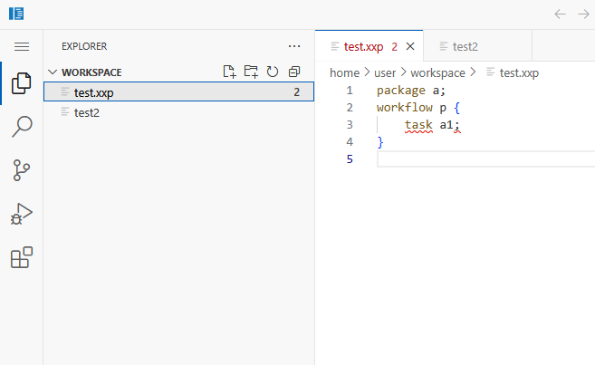

# Experiment DSL Language Server
The language server provides grammar validation of DSL in preferred editor, for example Visual Studio Code or IntelliJ IDEA. The language server has fundamentally two sides, server side and clients side. 

- Server side: the language server written in XText and running in JAVA
- Client side: the VS code instance which installs the XXP language extension

## Deployment
There are two ways to deploy the IDE with Docker:

1. [Independent](#independent-deployment): where the IDE stands alone
1. [Integrated](#integrated-deployment): The IDE will be part of the ExtremeXP Portal and will be shown as an iframe


### Independent Deployment

1. The IDE repo (current repo)
1. The language server repo (https://github.com/extremexp-HORIZON/extremexp-dsl-framework)

Set the following global variables:
```bash
  export DSL_REPO_PATH=/path/to/extremexp-dsl-framework
  export DSL_LOGS_PATH=/path/to/logs/lang-server/ #this directory should exist
  
  export IDE_REPO_PATH=/path/to/extremexp-ide
  export IDE_LOGS_PATH=/path/to/logs/ide/ #this directory should exist

  export IDE_HOST_URL=http://x.x.x.x   # ip of the current running server

  export SHARED_WORKSPACE_PATH=/path/to/shared/workspace # this directory should exist with <x>:<root> owner
```

**NOTE**, if `root` is running the docker, the shared workspace can be owned under root:root.


Once the variables are set, then run the docker compose as following:
```bash
/path/to/extremexp-ide$  docker compose -f docker-compose-independent.yml up -d
```

Once run, the http://x.x.x.x:8080/?folder=/home/user/workspace/ should show an instance of VS code which the XXP DSL is enabled in it. Note that the syntax highlight and syntax correction is both available in the IDE



### Integrated Deployment