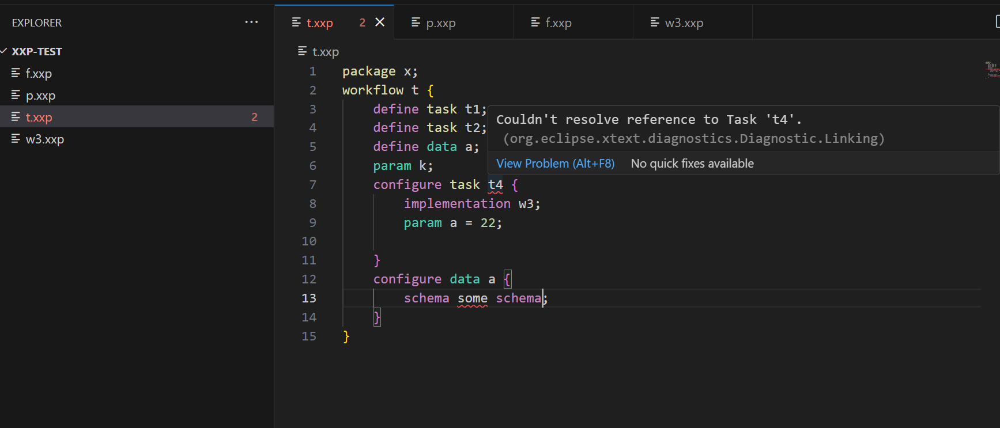

# Experiment DSL Language Server
The language server provides grammar validation of DSL in preferred editor, for example Visual Studio Code or IntelliJ IDEA. The language server has fundamentally two sides, server side and clients side. 

- [Server Side](#server-side)
- [Client Side](#client-side)

## Server Side 
The server in this case is an executable JAR built from [LanguageServer.java](https://colab-repo.intracom-telecom.com/colab-projects/extremexp/experiment-modelling/extremexp-dsl-framework/-/blob/main/eu.extremexp.dsl.parent/eu.extremexp.dsl.ide/src/eu/extremexp/dsl/ide/ServerLauncher.java?ref_type=heads), from [extremexp-dsl-framework](https://colab-repo.intracom-telecom.com/colab-projects/extremexp/experiment-modelling/extremexp-dsl-framework) repository, where the grammar is defined. The server listens to port `5007`.

At this moment, the server is a prototype and to quickly launch it, the executable JAR file is provided, no need to build it from the source. Simply, run the JAR file, as:

```cmd
java -jar server/eu.extremexp.dsl.ide-1.0.0-SNAPSHOT-ls.jar
```
To ensure that you are running the current version of the language, a message will be printed:

```
Welcome to XXP LSP version 4.0
```

*Note*: the server closes when the editor (client) is closed. 


## Client Side
The client side for each editor is a separated project, which develops an extension of the same editor. 

- [Visual Studio Code](#visual-studio-code)
- [IntelliJ IDEA](#intellij-idea)

### Visual Studio Code
For a full documentation please attend to [Language Server Extension Guide](https://code.visualstudio.com/api/language-extensions/language-server-extension-guide). In this project we have replaced the server side of the language server to our implemented grammar. However, the client side is designed according to the documentation. 

1. Open `client/vs-code` folder as a Visual Studio Code project
    ```cmd
    cd client/vs-code
    code .
    ```

1. Install `node_modules`:
    ```cmd
    npm install
    ```

1. Run the extension:

    There now should be a folder with generated `extension.js` at [client/vs-code/src/out/extension.js](client/vs-code/src/out/extension.js). Open the file, and press **F5** (or goto *RUN->Start Debugging*). There must be a number of options to run the extension as, select **VS Code Extension Development**. A new Visual Stdio Code (*extension*) will appear.

1. Test the editor:

    Open an empty folder and create files with extension `.xxp`. Please keep in mind that the name of workflows should be same as the name of the files. There is no syntax-highlight at this moment, so the editor would look like this:

    


    **Now try to make an (or multiple) error(s)**:
    

Once the extension project is closed, the server listener is also closed.


## Hosting the language server
The language server can be hosted with both the client and server sides in one container and accessed with the web editor. The editor is an instance of [code-server](https://github.com/coder/code-server), which enables `vs-code` to run from a browser. For this we provide a docker image  configured and loaded with both client and server side files. 

### Linux
First download the image using:

```bash
curl -O http://expvis.smartarch.cz:8080/xxp-lang-server-image.tar
```
Create a folder for your **examples**, then load the image and run it as a container using `docker` or `podman`. 


- **Docker**
    ```bash
    docker load -i xxp-lang-server-image.tar
    ```

    Under `/opt/` create a folder with name of `xxp-lang-editor`, and the `cd` to it. Then create `docker-compose.yml` as:

    ```yaml
    services:
    xxp-lang-editor:
        image: localhost/xxp-lang-server-image
        container_name: xxp-lang-editor
        ports:
        - "127.0.0.1:8080:8080"
        volumes:
        - /<path>/<to>/examples:/home/ubuntu:rw
        command: /lang_server/run.sh
    ```

    Then run the docker:
    ```bash
    docker compose up -d
    ```

OR

- **Podman**
    ```bash
    podman load -i xxp-lang-server-image.tar
    ```

    ```bash
    mkdir examples
    podman run --detach --name xxp-lang-editor --publish 127.0.0.1:8080:8080/tcp -v /<path>/<to>/examples/:/home/ubuntu/:rw xxp-lang-server-image /lang_server/run.sh
    ```


Now the editor should be running and the example folder is accessible on 

http://127.0.0.1:8080/?folder=/home/ubuntu

To stop the container use:

#### Podman
```bash
podman kill xxp-lang-editor
```

#### Docker
```bash
cd /opt/xxp-lang-editor/
docker compose down
```

#### Note
If you are hosting the editor on a server you may publish to `0.0.0.0:<PORT>` and make sure that `ipv4` ip forwarding is enabled on your server. Open **/etc/sysctl.conf** and uncomment (or set) `net.ipv4.ip_forward = 1`.


### Windows
TODO